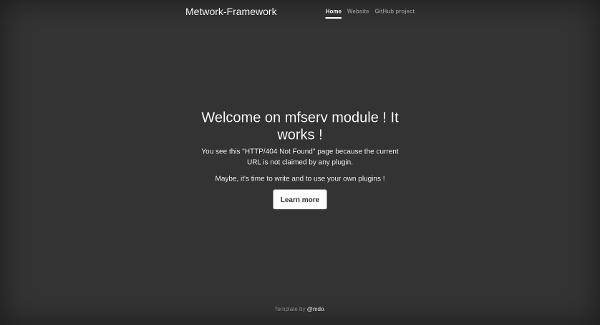

# Quickstart

## Installation

**On a Linux CentOS 6, 7 or 8 box**

??? question "What about other Linux distributions?"
    This quickstart is easily adaptable to other Linux distributions. To install
    on your favorite one, have a look at the [complete installation guide]({{installation_guide}}).

```bash
# AS root USER

# First, we configure the Metwork Framework repository for stable releases
cat >/etc/yum.repos.d/metwork.repo <<EOF
[metwork_stable]
name=MetWork Stable
baseurl=http://metwork-framework.org/pub/metwork/releases/rpms/stable/portable/
gpgcheck=0
enabled=1
metadata_expire=0
EOF

# Then we install the full version of mfserv module
# (full to get the nodejs support)
yum -y install metwork-mfserv-full

# Let's start Metwork services
# (or "systemctl start metwork.service" if you don't have the "service" command)
service metwork start

# Done :-)
```

## Test

Open a browser on [http://127.0.0.1:18868](http://127.0.0.1:18868). You should get:



## Let's make a static plugin

Let's make a static plugin to start. A static plugin is just a plugin to
host and serve static files (html pages, images...). This is a very basic one.

```bash
# AS mfserv USER
# (with "sudo su - mfserv" for example from your own admin account
#  or with "su - mfserv" as root)

# Boostrap our my_first_static_plugin with the static template
bootstrap_plugin.py create  --no-input --template=static my_first_static_plugin

# Install it (in dev mode)
cd my_first_static_plugin
make develop

# Create a first static webpage in main/index.html file
cat >main/index.html <<EOF
<html>
    <head>
        <title>My first webpage</title>
    </head>
    <body>
        <p>
            Hello World!
        </p>
    </body>
</html>
EOF
```

Open a browser on [http://localhost:18868/my_first_static_plugin/](http://localhost:18868/my_first_static_plugin/) and it works!

## Let's make a python3 flask plugin

```bash

# At this moment, we have:
$ plugins.list

┌Installed plugins (2)───┬───────────────────────────┬──────────┬─────────────────────────────────────────────────┐
│ Name                   │ Version                   │ Release  │ Home                                            │
├────────────────────────┼───────────────────────────┼──────────┼─────────────────────────────────────────────────┤
│ welcome                │ integration.ci617.dc2e671 │ 1        │ /home/mfserv/var/plugins/welcome                │
│ my_first_static_plugin │ dev_link                  │ dev_link │ /home/mfserv/var/plugins/my_first_static_plugin │
└────────────────────────┴───────────────────────────┴──────────┴─────────────────────────────────────────────────┘
```

Let's add another plugin with Python3 and the Flask web framework now:

```
# Still with mfserv user

# Boostrap our my_py3_plugin with the python3_flask template
bootstrap_plugin.py create  --no-input --template=python3_flask my_py3_plugin

# Install it (in dev mode)
cd my_py3_plugin
make develop
```

Wait a little bit (after installing a new plugin, a restart is automatically done). Then
open a browser on [http://127.0.0.1:18868/my_py3_plugin/](http://127.0.0.1:18868/my_py3_plugin/).

Then:

```
# open the main/wsgi.py file
# and change the "Hello World!" text message
```

Wait a little bit and refresh [http://127.0.0.1:18868/my_py3_plugin/](http://127.0.0.1:18868/my_py3_plugin/).

??? info "502 Bad Gateway?"
    If you have some HTTP/502 errors, maybe you were too fast and you hit the server during the restart process.
    Wait a few seconds and try again!

## Let's make a nodejs plugin

```
# Still with mfserv user

# Boostrap our my_node_plugin with the node template
bootstrap_plugin.py create  --no-input --template=node my_node_plugin

# Install it (in dev mode)
cd my_node_plugin
make develop
```

Wait a little bit and open [http://127.0.0.1:18868/my_node_plugin/](http://127.0.0.1:18868/my_node_plugin/).

??? info "502 Bad Gateway?"
    If you have some HTTP/502 errors, maybe you were too fast and you hit the server during the restart process.
    Wait a few seconds and try again!
