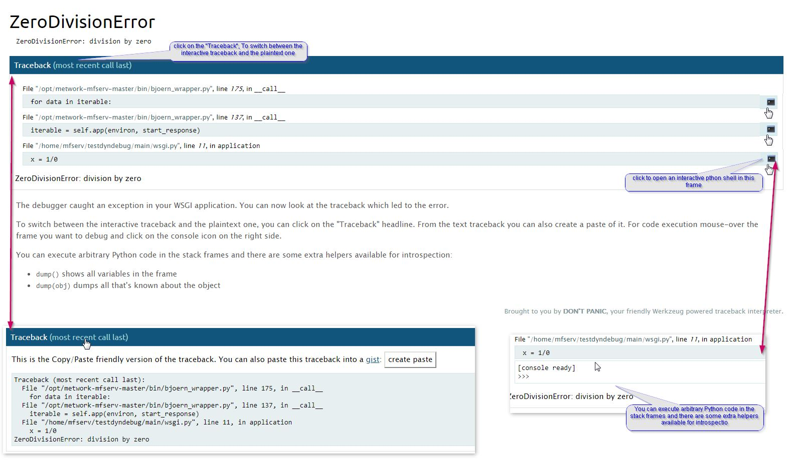

# Debug a plugin

## Application Log level

Log level is defined in the `[log]` section of the `~/config/config.ini` file of the module.

There are 2 parameters :

- minimal_level[DEV]: log level in development environment (plugin installed as dev build). default value is `DEBUG`
- minimal_level: log level in production environment. default value is `INFO`

You can change the log level. After changing it, you have to stop and start MFSERV to reload the configuration, by entering the commands :

- either
```bash
mfserv.stop
mfserv.start
```

- or (as root user)
```bash
service metwork restart mfserv
```
!!! tip "See also:" 

    - [Exporting logs](../../mfadmin/950-old_docs/mfadmin_miscellaneous/#26-exporting-logs)
    - [Monitoring plugins](../../mfadmin/950-old_docs/mfadmin_monitoring_plugins/)

## Nginx Access Log

Nginx writes logs information in the access log regarding each request made by a client.

By default, these access logs are enaable. But you can prevent Nginx Access Log from being written by setting `logging` parameter in the  `[nginx]` section of the `~/config/config.ini` file of the module:

```cfg
# If logging=0, do not log anything in nginx_access.log
logging=1
```
## Interactive debugger

An interactive debugger is available for python plugins such as `python3_flask`, `python3_django`, `python3_aiohttp`, etc...

In order to show you how it works, follow the instruction below.


Create a plugin with the [default (flask) template](../850-reference/plugin_templates/default/100-intro/)
```cfg
 bootstrap_plugin.py create testdyndebug
```

Set the `debug` parameter to 1 (instead of 0) in the `[app_...]` section of the plugin `config.ini` file:
```cfg
# If you set debug=1, numprocesses will be forced to 1 and we will try
#   to set all debug options and features (max_age will also be forced
#   to 0 and mflog minimal level will be set to DEBUG)
# DON'T USE IT ON PRODUCTION!!!
debug=1
```

Then, when your plugin is created, edit the `main/wsgi.py` script an raise intentionally an error:
```python
import os
import mflog
from flask import Flask, render_template

app = Flask(__name__)
if os.environ.get('MFSERV_CURRENT_APP_DEBUG', '0') == '1':
    app.config['PROPAGATE_EXCEPTIONS'] = True
logger = mflog.get_logger(__name__)


@app.route("/my_plugin/")
def hello_world():
    logger.info("This is an info message")
    x=1/0
    return "Hello World !"
```

Build the plugin by entering the `make develop` command.

Then, run and check your application from a browser by entering the application url `http://{your_host_name}:18868/testdyndebug` (e.g.: http://localhost:18868/testdyndebug)*[]:

You should see an HTML page containing the stack trace of the application error like this:



!!! note
    If you are running a [Django project plugin](../../850-reference/plugin_templates/python3_django/100-intro/), the debug HTML page is sightly different and you can't execute arbitrary python code in the stack frames.


## Entering the plugin environment

In some cases, you would like to run commands from your plugin environment, e.g. `django` command line.

In order to do this, run the command `plugin_env` from the root directory of the plugin.

Then, you have entered the environment of your plugin and you are able to run commands through a command line in this plugin environment.
