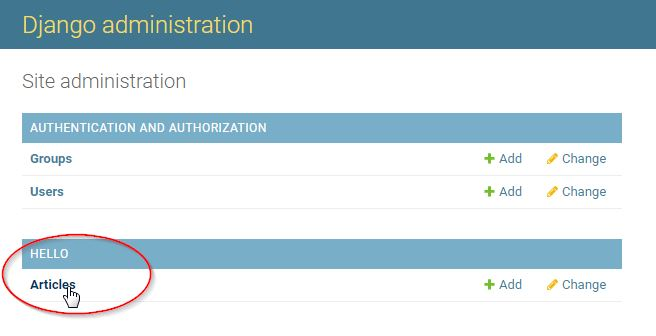

# Python3_django3 plugin tutorial

Let's create a plugin based on the [python3_django3 plugin template](../../850-reference/plugin_templates/python3_django3/100-intro/). We will called it **foo_django3**.

First, **bootstrap** the plugin with the command:
```bash
bootstrap_plugin.py create --template=python3_django3 foo_django3
```

Once you have entered this command, you will be asked to fill in some fields to configure and customize your plugin: for now, press `[ENTER]` to set the default values, you will be able to modify your plugin configuration anytime later.

The plugin is created in the current directory, inside the directory named `foo_django3`.

Check this directory, it contains only few files.

Let's now **build** the plugin by entering the command from the `foo_django3` plugin directory:

```bash
make develop
```

This command will download and install Django framework and some other dependencies. It will also create the Django project with an "Hello World!" application.

!!! important

    - if you are behind a proxy, you have to set `http_proxy` and `https_proxy` environment variables in order to be able to download any Python package you may need.
    - you may also need to disable your Linux firewall:
    ```
          systemctl status firewalld
          systemctl stop firewalld.service
          systemctl disable firewalld
    ```

Once build is done, the `foo_django3` plugin directory contains additional files and directories:

- **db.sqlite3** file: the default [SQLite](https://www.sqlite.org/index.html) database
- **manage.py** file: a convenience script that allows you to run administrative tasks like Django's included django-admin (see [django-admin and manage.py](https://docs.djangoproject.com/en/stable/ref/django-admin/))
- **foo_django3** directory: the Python package for your project. Its name is the Python package name you’ll need to use to import anything inside it. This directory contains:
    - **\_\_init\_\_.py**: An empty file that tells Python that this directory should be considered a Python package. If you’re a Python beginner, read more about packages in the official Python docs.
    - **settings.py**: Settings/configuration for this Django project. [Django settings](https://docs.djangoproject.com/en/stable/topics/settings/) will tell you all about how settings work.
    - **urls.py**: The URL declarations for this Django project; a “table of contents” of your Django-powered site. You can read more about URLs in [URL dispatcher](https://docs.djangoproject.com/en/stable/topics/http/urls/).
    - **wsgi.py**: An entry-point for WSGI-compatible web servers to serve your project.
    - **static**: Static files of the applications (read more about [The staticfiles app](https://docs.djangoproject.com/en/stable/ref/contrib/staticfiles/) and [Managing static files](https://docs.djangoproject.com/en/3.2/howto/static-files/)).
- **main** directory: the `main` application directory containing the application template files.


Now, you can check your application works by invoking the following URL: http://localhost:18868/foo_django3/main (you may replace localhost by your remote host if needed). A HTML page must display `Hello World from django main app`.

Now, let's create a data model.

Go to the `main` directory of the plugin.

Edit the `models.py` as below:
```python
from django.db import models

# Create your models here.

STATUS_CHOICES = [
    ('d', 'Draft'),
    ('p', 'Published'),
    ('w', 'Withdrawn'),
]


class Article(models.Model):
    title = models.CharField(max_length=100)
    body = models.TextField()
    status = models.CharField(max_length=1, choices=STATUS_CHOICES)
    test = models.TextField(default = "sdsd")

    def __str__(self):
        return self.title

```

Edit the `admin.py` as below:
```python
from django.contrib import admin

# Register your models here.
from main.models import Article

admin.site.register(Article, admin.ModelAdmin)
```

Build the plugin with `make develop` command.

Then, enter into the plugin environment in order to be able to execute Django commands. Enter [`plugin_env`](../../350-plugin_guide/#214-plugin-env)  command.

Create new migrations based on the changes detected to your models. Enter : 
```
    python manage.py makemigrations
```

Synchronize the database state with the current set of the model. Enter :
```
    python manage.py migrate
```

!!! info "See also [Django migrations documentation](https://docs.djangoproject.com/en/stable/topics/migrations)"

In order to check the model has been created in the SQLite database, enter :
```
    sqlite3 db.sqlite3
```
then enter the following SQLite/SQL command:
```sql
.tables
```

Output :
```
auth_group                  django_admin_log
auth_group_permissions      django_content_type
auth_permission             django_migrations
auth_user                   django_session
auth_user_groups            main_article
auth_user_user_permissions
```
You should see the `main_article` is created

Create a superuser in order to be able to connect to the Django Administration site. Enter:
```
    python manage.py createsuperuser
```
 and set fields (see [Creating an admin user](https://docs.djangoproject.com/en/stable/intro/tutorial02/#creating-an-admin-user)).

Now, from a browser, connect to the Django Administration site by invoking the following URL: http://localhost:18868/foo_django3/admin (you may replace localhost by your remote host if needed).

Log in with the account you have just created.

Then click the **Articles** link in order to manipulate `Article` data (view, add, change, delete...):




In order to check the `main` application access to the database, edit the **main/views.py** as below:
```python
from django.http import HttpResponse
from main.models import Article

def index(request):
    article_list = Article.objects.all()
    return HttpResponse("Hello World from django app. You have {} article(s).".format(article_list.count()))
```

Build again the plugin (`make develop` command).

Check your application still works by invoking the following URL: http://localhost:18868/foo_django3/main

!!! hint
    Set the `debug` parameter to 1 (instead of 0) in the `[app_...]` section of the plugin `config.ini` file, in order to get an **interactive debugger** in your browser: check [Interactive debugger](../../360-mfserv_debug_plugin/#3-interactive-debugger).

!!! info "See also [Configure a Metwork module](../../300-configuration_guide/#2-how-to-configure-a-metwork-module)"

