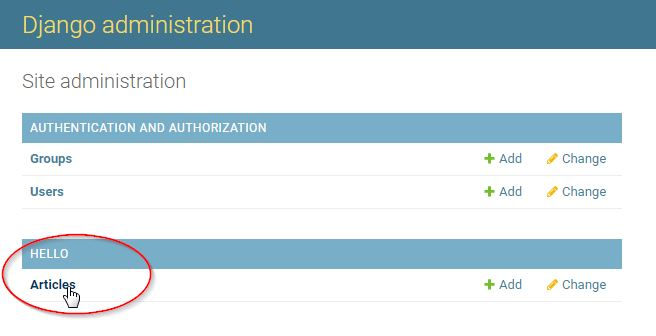

# Tutorials

.. index:: Django project, Django template
## Django project plugin

.. hint::
    **Before starting this tutorial, if not done yet, we recommend to have a look at the** :ref:`Django template section <mfserv_create_plugins_the_django_template>`.

Let's create a plugin based on the :ref:`Django template <mfserv_create_plugins_the_django_template>`. We will called it **foo_django**.

First, **bootstrap** the plugin with the command:
 ```bash
bootstrap_plugin.py create --template=django foo_django
```

Once you have entered this command, you will be asked to fill in some fields to configure and customize your plugin: for now, press `[ENTER]` to set the default value, you will be able to modify your plugin configuration anytime later.

The plugin is created in the current directory, inside the directory named `foo_django`.

Check this directory, it contains only few files.

Let's now **build** the plugin by entering the command from the `foo_django` plugin directory:

```bash
make develop
```

This command will download and install Django framework and some other dependencies. It will also create the Django project with an "Hello World!" application.

.. important::
    | - if you are behind a proxy, you have to set `http_proxy` and `https_proxy` environment variables in order to be able to download any Python package you may need.
    | - you may also need to disable your Linux firewall:
    |   `systemctl status firewalld`
    |   `systemctl stop firewalld.service`
    |   `systemctl disable firewalld`

Once build is done, the `foo_django` plugin directory contains additional files and directories:
- **db.sqlite3** file: the default [SQLite](https://www.sqlite.org/index.html) database
- **manage.py** file: a convenience script that allows you to run administrative tasks like Django's included django-admin (see [django-admin and manage.py](https://docs.djangoproject.com/en/stable/ref/django-admin/))
- **foo_django** directory: the Python package for your project. Its name is the Python package name you’ll need to use to import anything inside it. This directory contains:
    - **\_\_init\_\_.py**: An empty file that tells Python that this directory should be considered a Python package. If you’re a Python beginner, read more about packages in the official Python docs.
    - **settings.py**: Settings/configuration for this Django project. [Django settings](https://docs.djangoproject.com/en/stable/topics/settings/) will tell you all about how settings work.
    - **urls.py**: The URL declarations for this Django project; a “table of contents” of your Django-powered site. You can read more about URLs in [URL dispatcher](https://docs.djangoproject.com/en/stable/topics/http/urls/).
    - **wsgi.py**: An entry-point for WSGI-compatible web servers to serve your project.
    - **static**: Static files of the applications (read more about [The staticfiles app](https://docs.djangoproject.com/en/stable/ref/contrib/staticfiles/) and [Managing static files](https://docs.djangoproject.com/en/2.2/howto/static-files/)).
- **hello** directory: the `hello` application directory containing the application template files.


Now, you can check your application works by invoking the following URL: http://localhost:18868/foo_django/hello (you may replace localhost by your remote host if needed). A HTML page must display `Hello World from django app`.

Now, let's create a data model.

Go to the `hello` directory of the plugin.

Edit the `models.py` as below:
```python
from django.db import models

# Create your models here.

STATUS_CHOICES = [
    ('d', 'Draft'),
    ('p', 'Published'),
    ('w', 'Withdrawn'),
]


class Article(models.Model):
    title = models.CharField(max_length=100)
    body = models.TextField()
    status = models.CharField(max_length=1, choices=STATUS_CHOICES)
    test = models.TextField(default = "sdsd")

    def __str__(self):
        return self.title

```

Edit the `admin.py` as below:
```python
from django.contrib import admin

# Register your models here.
from hello.models import Article

admin.site.register(Article, admin.ModelAdmin)
```

Build the plugin with `make develop` command.

Then, enter into the plugin environment in order to be able to execute Django commands: enter :ref:`plugins_guide:\`\`plugin_env\`\`` command.

Create new migrations based on the changes detected to your models: enter `python manage.py makemigrations`.

Synchronize the database state with the current set of the model: enter `python manage.py migrate`.

.. seealso::
    | `Django migrations documentation <https://docs.djangoproject.com/en/stable/topics/migrations/>`_

In order to check the model has been create in the SQLite database, enter `sqlite3 db.sqlite3`, then enter the following SQLite/SQL commands:
```sql
.tables
```

```
auth_group                  django_admin_log
auth_group_permissions      django_content_type
auth_permission             django_migrations
auth_user                   django_session
auth_user_groups            hello_article
auth_user_user_permissions
```

You should see the `hello_article` is created.

Create a superuser in order to be able to connect to the Django Administration site: enter `python manage.py createsuperuser` and set fields (see [Creating an admin user](https://docs.djangoproject.com/en/stable/intro/tutorial02/#creating-an-admin-user)).

Now, from a browser, connect to the Django Administration site by invoking the following URL: http://localhost:18868/foo_django/admin (you may replace localhost by your remote host if needed).

Log in with the account you have just created.

The click the **Articles** link in order to manipulate `Article` data (view, add, change, delete...):




In order to check the `hello` application access to the database, edit the **hello/views.py** as below:
```python
from django.http import HttpResponse
from hello.models import Article

def index(request):
    article_list = Article.objects.all()
    return HttpResponse("Hello World from django app. You have {} article(s).".format(article_list.count()))
```

Build again the plugin (`make develop` command).

Check your application still works by invoking the following URL: http://localhost:18868/foo_django/hello

.. hint::
    Set the `debug` parameter to 1 (instead of 0) in the `[app_...]` section of the plugin `config.ini` file, in order to get an **interactive debugger** in your browser: check :ref:`Interactive debugger section <mfserv_debug_plugin:Interactive debugger>`

.. seealso::
    | :doc:`../configure_a_metwork_package`.


.. index:: Flask template, Jinja2
## Flask plugin

Let's create a plugin based on the :ref:`Flask template <mfserv_create_plugins_the_flask_template>`. We will called it **foo_flask**.

First, **bootstrap** the plugin with the command:
 ```bash
bootstrap_plugin.py create --template=flask foo_flask
```

Once you have entered this command, you will be asked to fill in some fields to configure and customize your plugin: for now, press `[ENTER]` to set the default value, you will be able to modify your plugin configuration anytime later.

The plugin is created in the current directory, inside the directory named `foo_flask`.

Check this directory, it contains few files, including:
- **main** directory: the Python package for your project. Its name is the Python package name you’ll need to use to import anything inside it. This directory contains:
    - **\_\_init\_\_.py**: An empty file that tells Python that this directory should be considered a Python package. If you’re a Python beginner, read more about packages in the official Python docs.
    - **templates** directory: It contains samples Jinja template page
    - **wsgi.py**: An entry-point for WSGI-compatible web servers to serve your project.


Let's now **build** the plugin by entering the command from the `foo_django` plugin directory:

```bash
make develop
```

This command will download and install Flaks framework and some other dependencies. It will also create a Flask project with an "Hello World!" application.

.. important::
    | - if you are behind a proxy, you have to set `http_proxy` and `https_proxy` environment variables in order to be able to download any Python package you may need.
    | - you may also need to disable your Linux firewall:
    |   `systemctl status firewalld`
    |   `systemctl stop firewalld.service`
    |   `systemctl disable firewalld`


Now, you can check your application works by invoking the following URL: http://localhost:18868/foo_flask (you may replace localhost by your remote host if needed). A HTML page must display `Hello World!`.

Check the **wsgi.py** to discover the other urls (routes) provided by this template, e.g.
- http://localhost:18868/foo_flask/john
- http://localhost:18868/foo_flask/harry
- http://localhost:18868/foo_flask/webpage
- http://localhost:18868/foo_flask/jinja2
- http://localhost:18868/foo_flask/jinja2/john
- ...


.. index:: Node.js application, Node.js template, node template
## Node.js plugin

Let's create a plugin based on the :ref:`Node template <mfserv_create_plugins_the_node_template>`. We will called it **foo_nodejs**.

First, **bootstrap** the plugin with the command:
 ```bash
bootstrap_plugin.py create --template=node foo_nodejs
```

Once you have entered this command, you will be asked to fill in some fields to configure and customize your plugin: for now, press `[ENTER]` to set the default value, you will be able to modify your plugin configuration anytime later.

The plugin is created in the current directory, inside the directory named `foo_nodejs`.

Check this directory, it contains few files, including:
- **foo_nodejs** directory: the node.js scripts for your project. Its name is the package name you’ll need to use to import anything inside it. This directory contains:
    - **server.js**: An entry-point for Node.js web servers to serve your project.
- **package.json** file: A kind of a manifest for your project. It can do a lot of things, completely unrelated. It’s a central repository of configuration for tools.


Let's now **build** the plugin by entering the command from the `foo_django` plugin directory:

```bash
make develop
```
This command will download and install needed Javascript node modules.

A **package-lock.json** is automatically generated for any operations where npm modifies either the node_modules tree, or **package.json**.
It describes the exact tree that was generated, such that subsequent installs are able to generate identical trees, regardless of intermediate dependency updates.and some other dependencies.

You may also check the **node_modules** directory.

.. note::
    | What is the difference between package.json and package-lock.json ?
    | - **package-lock.json**: records the exact version of each installed package which allows you to re-install them. Future installs will be able to build an identical dependency tree. ...
    | - **package.json**: records the minimum version you app needs.

.. important::
    | **package-lock.json** is intended to be checked into source control, as Git. You should commit this file.

.. important::
    | - if you are behind a proxy, you have to set `http_proxy` and `https_proxy` environment variables in order to be able to download any Python package you may need.
    | - you may also need to disable your Linux firewall:
    |   `systemctl status firewalld`
    |   `systemctl stop firewalld.service`
    |   `systemctl disable firewalld`


Check the `foo_nodejs/server.js` script. It is a basic [Express](https://expressjs.com/) application (app) which starts a server and listens for connection.
This application responds with `Hello World foo_nodejs!` for requests to the homepage. For every other path, it will respond with an `HTTP 404 Not Found`.

You will also see some calls to start and stop functions and callbacks from `metwork_tools` module to neatly start and stop the application:
```js
...
// call metwork before_start
metwork_tools.before_start(unix_socket_path)

...
// call before_stop on SIGTERM
process.on('SIGTERM', function () {
    metwork_tools.before_stop(unix_socket_path)
})

// call after_stop on exit
process.on('exit', function () {
    metwork_tools.after_stop(unix_socket_path)
})

// listen to the unix socket, set timeout and call after_start
server = app.listen(unix_socket_path, function () {
    metwork_tools.after_start(unix_socket_path)
})

...

```

Express application uses a callback function whose parameters are request and response objects:
```js

app.get('/foo_nodejs', function (req, res) {
      res.send('Hello World foo_nodejs!')
})

```

Now, you can check your application works by invoking the following URL: http://localhost:18868/foo_nodejs (you may replace localhost by your remote host if needed). A HTML page must display `Hello World from django app`.

We will extend our "Hello World!" application to handle more types of HTTP requests. Edit the the `foo_nodejs/server.js` script and add the following lines:
```js
// This responds a POST request for the /foo_nodejs home url
app.post('/foo_nodejs', function (req, res) {
   res.send('Hello World foo_nodejs from a POST request');
})

// This responds a GET request for wxy, waxy, w1234bxy, and so on...
app.get('/foo_nodejs/w*xy', function(req, res) {
   res.send('Page Pattern Match foo_nodejs');
})

// This responds a DELETE request for the /foo_nodejs/del_user url.
app.delete('/foo_nodejs/del_user', function (req, res) {
   res.send('Hello World foo_nodejs from a DELETE request');

})

// This responds a GET request for the /foo_nodejs/list_user url.
app.get('/foo_nodejs/list_user', function (req, res) {
   res.send('Page listing foo_nodejs');
})

```

Build the plugin with `make develop` command.

Check your application works by invoking the relevant URLs you added.

.. seealso::
    | :doc:`../configure_a_metwork_package`.


.. index:: default template, asyncio
## aiohttp python plugin

Let's create a plugin based on the :ref:`Default template <mfserv_create_plugins_the_default_template>` whose type is :index:`aiohttp`, i.e. [asynchronous Python3/asyncio web application](https://aiohttp.readthedocs.io/en/stable/web.html). We will called it **foo_aiohttp**.

First, **bootstrap** the plugin with the command (`--template=default` can be omitted):
 ```bash
bootstrap_plugin.py create foo_aiohttp
```

Once you have entered this command, you will be asked to fill in some fields to configure and customize your plugin: for now, press `[ENTER]` to set the default value, **except** when you will be asked the plugin **type**:
```bash
Select type:
1 - python3_sync
2 - python2_sync
3 - aiohttp
4 - gunicorn3_sync
5 - gunicorn2_sync
6 - gunicorn3_asyncio
Choose from 1, 2, 3, 4, 5, 6 [1]:
```
**Enter** `3` for **aiohttp**.

The plugin is created in the current directory, inside the directory named `foo_aiohttp`.

Check this directory, it contains few files, including:
- **main** directory: the Python package for your project. Its name is the Python package name you’ll need to use to import anything inside it. This directory contains:
    - **\_\_init\_\_.py**: An empty file that tells Python that this directory should be considered a Python package. If you’re a Python beginner, read more about packages in the official Python docs.
    - **application.py**: An entry-point for WSGI-compatible web servers to serve your project.

Let's now **build** the plugin by entering the command from the `foo_django` plugin directory:

```bash
make develop
```

Now, you can check your application works by invoking the following URL: http://localhost:18868/foo_aiohttp (you may replace localhost by your remote host if needed). A HTML page must display `Hello World from django app`.

.. hint::
    Set the `debug` parameter to 1 (instead of 0) in the `[app_...]` section of the plugin `config.ini` file, in order to get an **interactive debugger** in your browser: check :ref:`Interactive debugger section <mfserv_debug_plugin:Interactive debugger>`


Check the `foo_aiohttp/application.py` script. It is a basic [aiohttp](https://docs.aiohttp.org/en/stable) application (app) which create, start the application. It routes all incoming HTTP GET requests to a unique handler which return an "Hello World" HTTP response.

You will also see some calls to start and stop functions and callbacks from `metwork_tools` module to neatly start and stop the application:
When creating the application, you will see :ref:`MetWork middlewares <mfserv_aiohttp_middleware>` are passed to the `middlewares` parameter:

```python

def get_app(timeout=int(os.environ['MFSERV_NGINX_TIMEOUT']) - 2):
    app = web.Application(middlewares=[timeout_middleware_factory(timeout),
                                       mflog_middleware])
    app.router.add_get('/{tail:.*}', handle)
    return app
```
Ypu may disable these  :ref:`middlewares <mfserv_miscellaneous:Disable middleware (asyncio, aiohttp plugins)>`.


We will extend our "Hello World!" application to handle more types of HTTP requests. Edit the the `foo_aiohttp/application.py` script as below:
```python
import sys
import os
from aiohttp import web
from aiohttp_metwork_middlewares import mflog_middleware
from aiohttp_metwork_middlewares import timeout_middleware_factory

app_name = os.environ.get('MFSERV_CURRENT_PLUGIN_NAME', "unknown")

def get_url_prefix():
    return '/{}'.format(app_name)

async def home_get(request):
    log = request['mflog_logger']
    log.info("this is an info message from home_get")
    return web.Response(text="Hello World from a GET request")


async def home_post(request):
    log = request['mflog_logger']
    log.info("this is an info message from home_post")
    return web.Response(text="Hello World from a POST request")

async def pattern(request):
    log = request['mflog_logger']
    log.info("this is an info message from pattern")
    return web.Response(text="Hello World from a Pattern Match")


def get_app(timeout=int(os.environ['MFSERV_NGINX_TIMEOUT']) - 2):
    app = web.Application(middlewares=[timeout_middleware_factory(timeout),
                                       mflog_middleware])
    app.router.add_get(get_url_prefix(), home_get)
    # This responds a POST request for the home url
    app.router.add_post(get_url_prefix(), home_post)
    # This responds a GET request for wxy, waxy, w1234bxy, and so on...
    app.router.add_get(get_url_prefix() + '/{tail:w.*xy}', pattern)
    return app


if __name__ == '__main__':
    if len(sys.argv) == 3:
        web.run_app(get_app(int(sys.argv[2])), path=sys.argv[1])
    elif len(sys.argv) == 2:
        web.run_app(get_app(), path=sys.argv[1])
    else:
        web.run_app(get_app())

```

Build the plugin with `make develop` command.

Check your application works by invoking the relevant URLs you added.

You may also doing the same with decorators:

```python
import sys
import os
from aiohttp import web
from aiohttp_metwork_middlewares import mflog_middleware
from aiohttp_metwork_middlewares import timeout_middleware_factory

routes = web.RouteTableDef()
app_name = os.environ.get('MFSERV_CURRENT_PLUGIN_NAME', "unknown")


def get_url_prefix():
    return '/{}'.format(app_name)

@routes.get(get_url_prefix())
async def home_get(request):
    log = request['mflog_logger']
    log.info("this is an info message from home_get")
    return web.Response(text="Hello World from a GET request")

@routes.post(get_url_prefix())
async def home_post(request):
    log = request['mflog_logger']
    log.info("this is an info message from home_post")
    return web.Response(text="Hello World from a POST request")

@routes.get(get_url_prefix() + '/{tail:w.*xy}')
async def pattern(request):
    log = request['mflog_logger']
    log.info("this is an info message from pattern")
    return web.Response(text="Hello World from a Pattern Match")


def get_app(timeout=int(os.environ['MFSERV_NGINX_TIMEOUT']) - 2):
    app = web.Application(middlewares=[timeout_middleware_factory(timeout),
                                       mflog_middleware])
    app.add_routes(routes)
    return app


if __name__ == '__main__':
    if len(sys.argv) == 3:
        web.run_app(get_app(int(sys.argv[2])), path=sys.argv[1])
    elif len(sys.argv) == 2:
        web.run_app(get_app(), path=sys.argv[1])
    else:
        web.run_app(get_app())

```

.. seealso::
    | :ref:`mfserv_miscellaneous:Disable request ID to be appeared in the logs` section
    | `Official aiohttp documentation <http://docs.aiohttp.org/en/stable/>`_
    | :doc:`../configure_a_metwork_package`.


<!--
Intentional comment to prevent m2r from generating bad rst statements when the file ends with a block .. xxx ::
-->
