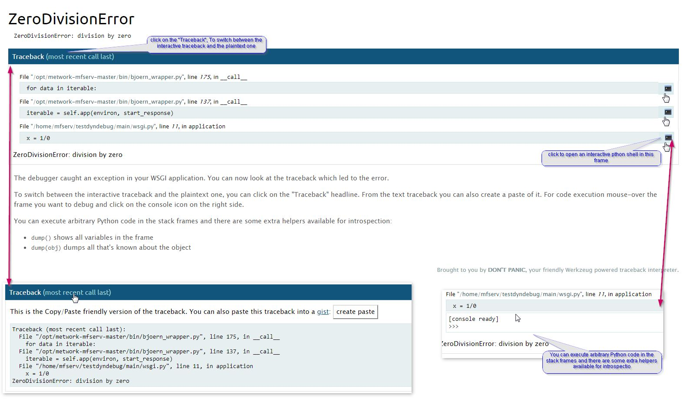

.. index:: debug, log, log level
# Debug a plugin

## Application Log level

Log level is defined in the `[log]` section of the `~/config/config.ini` file of the module.

There are 2 parameters :

- minimal_level[DEV]: log level in development environment (plugin installed as dev build). default value is `DEBUG`
- minimal_level: log level in production environment. default value is `INFO`

You can change the log level. After changing it, you have to stop and start MFSERV to reload the configuration, by entering the commands :

- either
```bash
mfserv.stop
mfserv.start
```

- or (as root user)
```bash
service metwork restart mfserv
```
.. seealso::
    | :ref:`mfadmin:mfadmin_miscellaneous:Exporting logs`
    | :doc:`mfadmin:mfadmin_monitoring_plugins`

.. index:: Nginx, Nginx Access Log, Enable/disable Nginx Access Log
## Nginx Access Log

Nginx writes logs information in the access log regarding each request made by a client.

By default, these access logs are enaable. But you can prevent Nginx Access Log from being writtent by setting `logging` parameter in the  `[nginx]` section of the `~/config/config.ini` file of the module:

```cfg
# If logging=0, do not log anything in nginx_access.log
logging=1
```
.. index:: Interactive debugger, debug
## Interactive debugger

An interactive debugger is available for `python3_sync`,  `python2_sync` and `aiothhp` plugin type created with the :ref:`default plugin template <mfserv_create_plugins_the_default_template>`.

In order to show you how it works, follow the instruction below.


Create a plugin with the :ref:`default template <mfserv_create_plugins_the_default_template>`:
```cfg
 bootstrap_plugin.py create testdyndebug
```

When **Select type** is asked, choose *1* (python3_sync - the default choice):

```cfg
 Select type:
1 - python3_sync
2 - python2_sync
3 - aiohttp
4 - gunicorn3_sync
5 - gunicorn2_sync
6 - gunicorn3_asyncio
Choose from 1, 2, 3, 4, 5, 6 [1]:
```

Set the `debug` parameter to 1 (instead of 0) in the `[app_...]` section of the plugin `config.ini` file:
```cfg
# if you set debug=1, then you will get an interactive debugger
# when you got an exception in your code
# (max age will also be automatically set to 0 and mflog minimal level will be
#  set to DEBUG)
# DON'T USE IT ON PRODUCTION!!!
debug=1
```

Then, when your plugin is created, edit the `main/wsgi.py` script an raise intentionally an error:
```python
from mflog import get_logger

logger = get_logger("myapp")


def application(environ, start_response):
    status = '200 OK'
    output = b'Hello World!'
    logger.info("this is a test message")
    # Raise intentionnally an excetion
    x = 1/0
    response_headers = [('Content-Type', 'text/plain'),
                        ('Content-Length', str(len(output)))]
    start_response(status, response_headers)
    return [output]
```

Build the plugin by entering the `make develop` command. You should notice because the `debug` parameter is set to 1, a warning message is displayed:
```
...
WARNING: this plugin has a debug == 1 setting for the app: main
  => This is a dangerous plugin which can break the whole
     mfserv module
  => But it can be assumed if you trust the author
```

Then, run and check your application from a browser by entering the application url `http://{your_host_name}:18868/testdyndebug` (e.g.: http://localhost:18868/testdyndebug)*[]:

You should see an HTML page containing the stack trace of the application error like this:



.. note::
    If you are running a :ref:`Django project plugin <mfserv_create_plugins_the_django_template>`, the debug HTML page is sightly different and you can't execute arbitrary python code in the stack frames.  containingWe will called it **foo_django**. to initialize a plugin containing


.. index:: plugin_env
## Entering the plugin environment

In some cases, you would like to run commands from your plugin environment, e.g. `django` command line.

In order to do this, run the command `plugin_env` from the root directory of the plugin.

Then, you have entered the environment of your plugin and you are able to run commands through a command line in this plugin environment.
